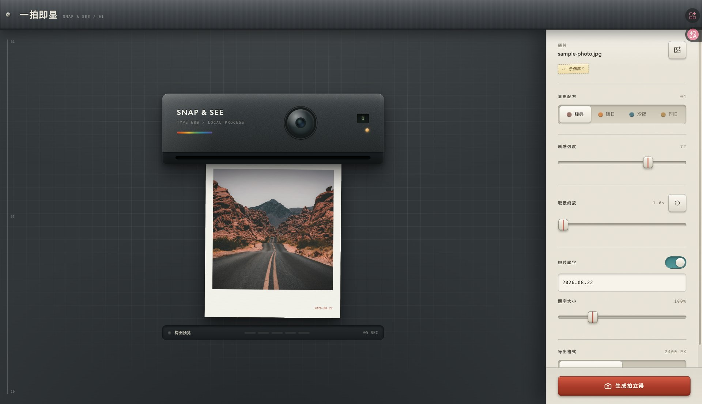

# 一拍即显 Snap & See

在浏览器里把普通照片「冲洗」成一张有真实显影过程的拍立得。
从底片进机、相纸吐出到影像浮现，整个过程都在本地完成——**照片不会离开你的设备**。



## 功能特性

- **拟真显影流程**：冲洗、出片、显影三段动画，还原拍立得的等待仪式感（可跳过，也尊重系统减弱动效设置）
- **四种显影配方**：经典 / 暖日 / 冷夜 / 作旧，配合 0–100 的质感强度自由调和
- **构图自由调整**：拖拽平移取景，滑杆或滚轮缩放（1.0–2.5x），所见即所得
- **照片题字**：自定义文字内容与字号（50%–250%），超长自动缩排防溢出
- **本地高清导出**：1800px 成片，JPEG / PNG 双格式，一键下载
- **多种导入方式**：文件选择、拖拽图片到页面、直接粘贴剪贴板截图
- **纯本地处理**：解码、调色、导出全部在浏览器内完成，零上传、零依赖服务端

## 快速开始

```bash
pnpm install
pnpm dev
```

打开终端提示的地址（默认 <http://localhost:5173>）即可体验，首次进入会自动加载一张示例底片。

## 常用命令

```bash
pnpm dev         # 启动开发服务器
pnpm build       # 类型检查 + 生产构建（输出 dist/）
pnpm preview     # 本地预览构建产物
pnpm typecheck   # TypeScript 类型检查
pnpm test        # 运行单元测试（Vitest）
```

## 技术栈

- **Vite 8** — 构建与开发服务器
- **React 19 + TypeScript** — 界面与状态机
- **Tailwind CSS 4** — 样式
- **Canvas 2D** — 逐像素胶片调色、纸纹与暗角合成
- **Vitest** — 单元测试

## 项目结构

```
src/
├── App.tsx                  # 应用状态机：loading → editing → processing → ejecting → developing → complete
├── components/
│   ├── CameraStage.tsx      # 拍立得机身舞台、预览画布、拖拽/滚轮取景
│   └── ControlPanel.tsx     # 配方、强度、构图、题字、导出控制面板
└── image/
    ├── decode-image.ts      # 图片解码与校验（格式 / 大小 / 分辨率）
    ├── render-polaroid.ts   # 拍立得渲染：胶片曲线、暗角、颗粒、纸纹、题字
    └── types.ts             # 共享类型定义
```

## 实现要点

- **两档预览渲染**：交互过程中以 360px 低分辨率实时渲染，停顿后补 720px 终稿，拖动滑杆不掉帧
- **结果保留**：显影完成后修改参数不会丢弃已生成的成片，可先下载旧片再决定是否重新生成
- **隐私优先**：示例照片之外的任何图片都只在本机内存中处理，刷新即消失

## 致谢

示例照片来自 [Unsplash](https://unsplash.com/photos/b586d89ba3ee)，仅用于首次进入时的初始体验，用户选图后会被本地照片替换。
